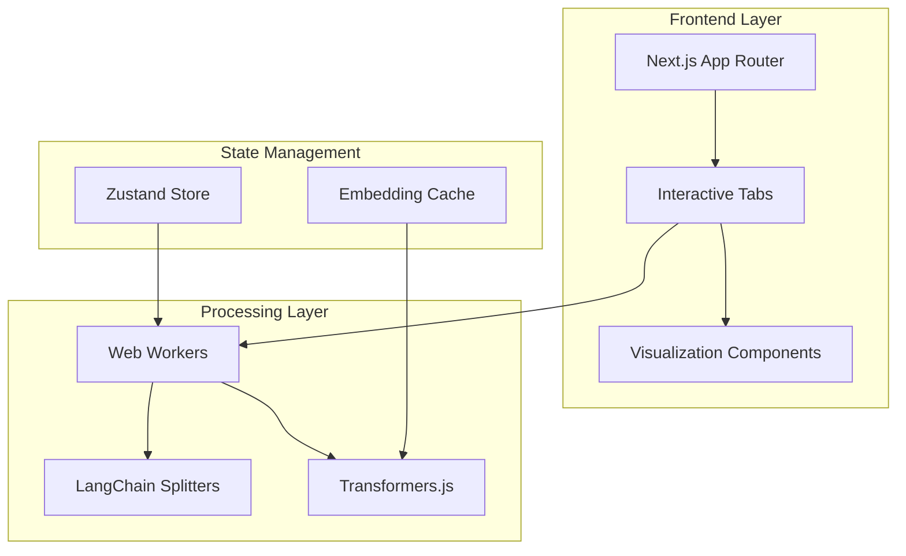
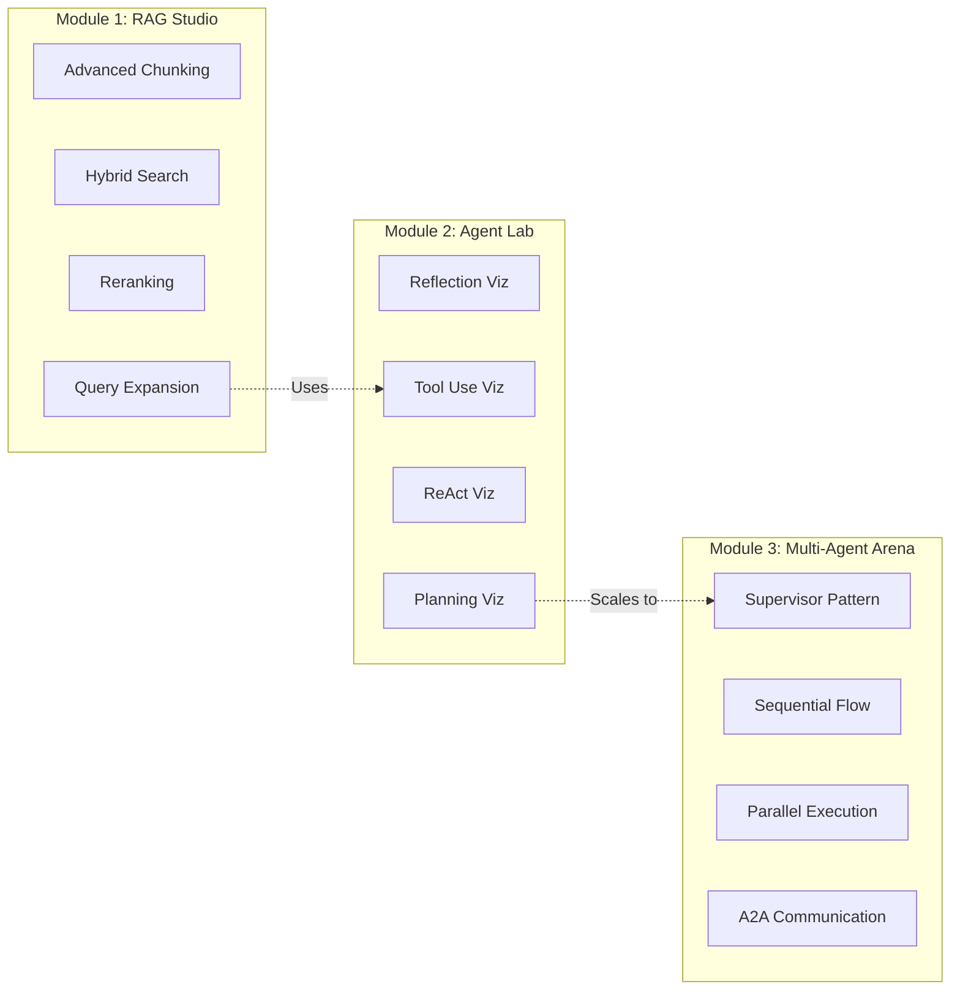
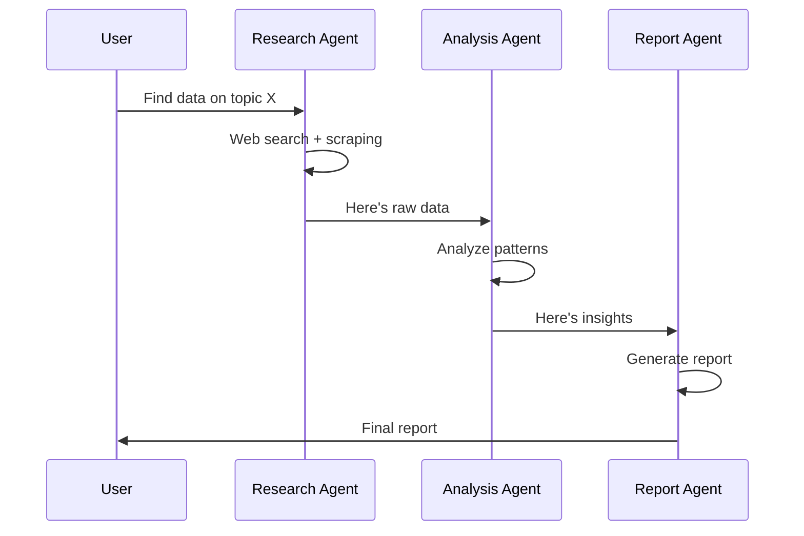
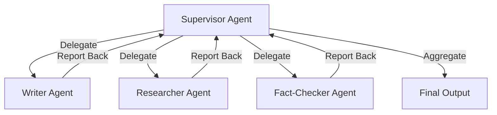
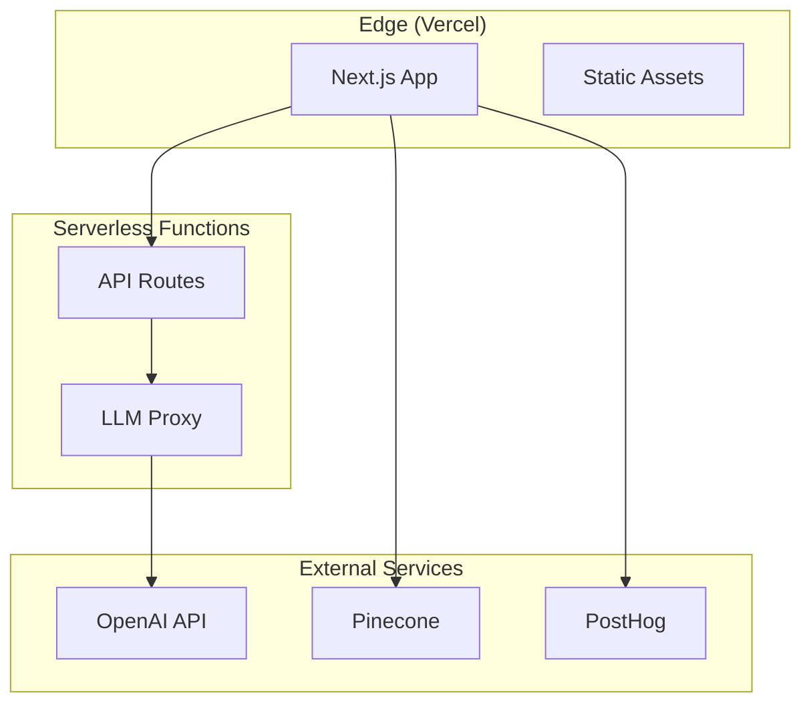

# From RAG to Agentic AI: Building an Interactive Learning Playground

**The biggest lie in AI education? "Just read the docs." The truth? You learn by seeing, touching, breaking things.**

When I discovered [RAG-Play](https://ragplay.vercel.app), I had that rare "aha!" moment. Here was someone who understood that learning RAG isn't about memorizing chunking strategies—it's about *watching* text split, *seeing* embeddings cluster, *feeling* the retrieval dance. But as I explored the tool, I kept thinking: "What if we could do this for the entire AI agent stack?"

## Why Visualization Changes Everything

Let me share something embarrassing: I spent two weeks reading papers on vector embeddings before RAGxplorer showed me in 30 seconds what UMAP actually *does* to high-dimensional space. The gap between conceptual understanding and intuitive grasp? Visualization bridges it.

**The Learning Pyramid Reality:**
- **Reading about chunking strategies**: 10% retention
- **Watching a video tutorial**: 20% retention  
- **Seeing live visualizations**: 50% retention
- **Building and experimenting**: 75% retention
- **Teaching others through tools**: 90% retention

This is why RAG-Play works. And this is why we need to extend it.

> **Carry this with you:** "Understanding happens at the intersection of theory and observable reality."

## Section 1: Deconstructing RAG-Play's Architecture

### What RAG-Play Nails

The [RAG-Play project](https://github.com/Kain-90/RAG-Play) demonstrates three core strengths:

**1. Progressive Complexity**
```
Text Splitting → Vector Embedding → Semantic Search → Generation
```

Each tab builds on the previous, mirroring how developers actually learn RAG. You don't jump into hybrid search before understanding basic chunking.

**2. Immediate Feedback**
Change chunk size from 500 to 1000 characters? Boom—instant visualization of how that impacts your chunks. This tight feedback loop is what separates great learning tools from documentation.

**3. Technology Choices That Make Sense**
- **Next.js 14**: Server-side rendering for initial load, client-side interactivity
- **Transformers.js**: In-browser embeddings (no backend needed!)
- **LangChain**: Battle-tested text splitting algorithms
- **shadcn/ui**: Clean, accessible components

### The Architecture Blueprint



**Why this works:**
- Web Workers keep UI responsive during heavy computation
- Client-side processing means no backend costs
- Cached embeddings prevent redundant computation

### What's Missing

RAG-Play is brilliant for RAG. But the AI landscape has evolved:

1. **No Agent Patterns**: Can't visualize ReAct loops or tool calling
2. **No Multi-Agent Orchestration**: Missing supervisor patterns, delegation flows
3. **No State Visualization**: Can't see how state evolves through workflows
4. **Limited Reranking**: Basic similarity only, no advanced reranking strategies

The opportunity? Extend this foundation to cover the full spectrum from RAG → Agents → Multi-Agent Systems.

## Section 2: The Agent Evolution - What We're Building Toward

### Understanding AI Agents

An AI agent isn't just an LLM with tools. It's a **reasoning loop**:

```python
while not task_complete:
    # 1. Perceive: Understand current state
    observation = perceive(environment)
    
    # 2. Reason: Decide next action
    action = llm.decide(observation, available_tools, history)
    
    # 3. Act: Execute the decision
    result = execute(action)
    
    # 4. Reflect: Learn from outcome
    update_memory(observation, action, result)
```

**The key difference from RAG:**
- RAG: Single retrieve → generate cycle
- Agent: Iterative observe → reason → act → learn cycles

### The 4 Core Agentic Design Patterns

Based on research from [Google Cloud](https://cloud.google.com/blog/topics/partners/building-scalable-ai-agents-design-patterns-with-agent-engine-on-google-cloud), [Microsoft](https://learn.microsoft.com/en-us/azure/architecture/ai-ml/guide/ai-agent-design-patterns), and [Salesforce](https://architect.salesforce.com/fundamentals/enterprise-agentic-architecture), these patterns are fundamental:

#### 1. **Reflection Pattern**
The agent critiques its own output.

```typescript
interface ReflectionState {
  initialDraft: string;
  critiques: string[];
  refinedOutput: string;
  iterationCount: number;
}

// Example: GitHub Copilot refining code
async function reflectionLoop(prompt: string): Promise<string> {
  let draft = await llm.generate(prompt);
  let iterations = 0;
  
  while (iterations < MAX_ITERATIONS) {
    const critique = await llm.evaluate(draft, criteria);
    if (critique.score >= THRESHOLD) break;
    
    draft = await llm.refine(draft, critique.feedback);
    iterations++;
  }
  
  return draft;
}
```

**Use Case**: Code generation, content writing, report creation

#### 2. **Tool Use Pattern**
The agent decides which tools to invoke.

```typescript
interface ToolUseState {
  query: string;
  availableTools: Tool[];
  toolCalls: ToolCall[];
  results: ToolResult[];
}

// Example: Research assistant
const tools = [
  { name: "web_search", description: "Search the internet" },
  { name: "calculator", description: "Perform calculations" },
  { name: "code_interpreter", description: "Execute Python code" }
];

async function toolUseAgent(query: string) {
  const plan = await llm.selectTools(query, tools);
  const results = await Promise.all(
    plan.map(tool => executeTool(tool))
  );
  return await llm.synthesize(query, results);
}
```

**Use Case**: Research, data analysis, automation

#### 3. **ReAct Pattern** (Reasoning + Acting)
Combines reasoning traces with actions.

```typescript
interface ReActState {
  thought: string;
  action: string;
  observation: string;
  history: ReActStep[];
}

// Example: Customer support agent
async function reactAgent(query: string) {
  let steps: ReActStep[] = [];
  let maxSteps = 5;
  
  for (let i = 0; i < maxSteps; i++) {
    const thought = await llm.think(query, steps);
    const action = await llm.decideAction(thought, availableActions);
    const observation = await executeAction(action);
    
    steps.push({ thought, action, observation });
    
    if (isTaskComplete(observation)) {
      return await llm.finalAnswer(query, steps);
    }
  }
}
```

**Use Case**: Debugging, customer support, complex problem-solving

#### 4. **Planning Pattern**
The agent creates a multi-step plan upfront.

```typescript
interface PlanningState {
  goal: string;
  plan: Step[];
  currentStep: number;
  results: StepResult[];
}

// Example: Project planning assistant
async function planningAgent(goal: string) {
  // Create plan
  const plan = await llm.createPlan(goal);
  
  // Execute plan with checkpoints
  for (let step of plan) {
    const result = await executeStep(step);
    
    // Dynamic replanning
    if (result.needsReplanning) {
      plan = await llm.replan(goal, executedSteps, result);
    }
  }
  
  return aggregateResults(results);
}
```

**Use Case**: Project management, trip planning, workflow automation

### Why These Patterns Need Visualization

Imagine debugging a ReAct agent that's stuck in a loop. Without visualization:
```
Thought: I should search for X
Action: search("X")
Observation: Found Y
Thought: I should search for X  # ← Loop! But where?
Action: search("X")
...
```

**With visualization:**
- See the decision tree in real-time
- Highlight repeated states
- Show which tools were considered vs. chosen
- Display reasoning traces alongside actions

> **Key insight:** "The difference between a working agent and a broken one is often one bad decision in a 20-step chain. Visualization makes that visible."

## Section 3: Architecture for the Extended Playground

### The Three-Module Vision



### Enhanced RAG Module Architecture

Building on RAG-Play's foundation, add advanced features:

```typescript
// Enhanced RAG Module Structure
interface RAGModuleState {
  // Existing
  documents: Document[];
  chunks: Chunk[];
  embeddings: Embedding[];
  
  // New additions
  rerankedResults: RankedChunk[];
  expandedQueries: string[];
  hybridScores: HybridScore[];
  parentChildMappings: ChunkMapping[];
}

// Example: Parent-Child Chunking Visualization
class ParentChildVisualizer {
  visualize(document: string) {
    const parents = this.chunkLarge(document, 2000); // Context
    const children = this.chunkSmall(document, 500);  // Precision
    
    return {
      hierarchy: this.buildHierarchy(parents, children),
      visualization: this.renderD3Tree(),
      searchDemo: this.interactiveSearch()
    };
  }
}
```

**Visualization Features:**
1. **Hierarchical Chunking Tree**: D3.js tree showing parent-child relationships
2. **Embedding Space Explorer**: 3D visualization using Three.js (like RAGxplorer)
3. **Reranking Comparison**: Side-by-side before/after reranking
4. **Hybrid Search Weights**: Interactive sliders showing sparse vs. dense impact

### Agent Lab Module Architecture

The heart of the new system:

```typescript
// Agent Lab Core Types
interface AgentState {
  pattern: 'reflection' | 'tool_use' | 'react' | 'planning';
  currentStep: number;
  history: AgentStep[];
  tools: Tool[];
  llmCalls: LLMCall[];
  performance: PerformanceMetrics;
}

interface AgentStep {
  timestamp: number;
  type: 'thought' | 'action' | 'observation' | 'reflection';
  content: string;
  metadata: Record<string, any>;
}

// Example: ReAct Visualization Component
class ReActVisualizer extends React.Component<AgentState> {
  render() {
    return (
      <div className="react-visualizer">
        {/* Step-by-step timeline */}
        <Timeline steps={this.props.history} />
        
        {/* Decision tree */}
        <DecisionTree 
          nodes={this.buildDecisionNodes()} 
          onNodeClick={this.showDetails}
        />
        
        {/* State inspector */}
        <StateInspector 
          currentState={this.props}
          allowEdit={true}
        />
        
        {/* Performance dashboard */}
        <MetricsDashboard metrics={this.props.performance} />
      </div>
    );
  }
}
```

**Key Components:**

1. **Live Execution Timeline**
```tsx
// Real-time step visualization
<Timeline>
  <Step type="thought" color="blue">
    Analyzing user query about weather...
  </Step>
  <Step type="action" color="green">
    Calling weather_api(location="Paris")
  </Step>
  <Step type="observation" color="purple">
    Temperature: 18°C, Conditions: Sunny
  </Step>
</Timeline>
```

2. **Interactive State Editor**
```tsx
// Let users modify agent state mid-execution
<StateEditor
  state={agentState}
  onUpdate={(newState) => {
    // Hot-reload agent with new state
    agent.updateState(newState);
    agent.continue();
  }}
/>
```

3. **Tool Call Visualizer**
```tsx
// Show tool selection reasoning
<ToolCallFlow>
  <AvailableTools tools={allTools} />
  <ReasoningTrace>
    "Need current information → web_search selected"
  </ReasoningTrace>
  <ExecutionResult result={toolOutput} />
</ToolCallFlow>
```

### Multi-Agent Arena Architecture

For orchestration patterns:

```typescript
// Multi-Agent System Types
interface MultiAgentState {
  agents: Agent[];
  orchestrator: Agent | null;
  communicationGraph: CommunicationEdge[];
  sharedMemory: SharedState;
  executionMode: 'sequential' | 'parallel' | 'supervisor' | 'network';
}

// Example: Supervisor Pattern Visualization
class SupervisorVisualizer {
  renderOrchestration() {
    return (
      <div className="supervisor-pattern">
        {/* Agent network graph */}
        <ForceGraph
          nodes={this.state.agents}
          edges={this.state.communicationGraph}
          onNodeClick={this.inspectAgent}
        />
        
        {/* Message passing visualization */}
        <MessageFlow
          messages={this.captureMessages()}
          animateFlow={true}
        />
        
        {/* Task delegation tree */}
        <DelegationTree
          supervisor={this.state.orchestrator}
          workers={this.state.agents}
        />
      </div>
    );
  }
}
```

**Pattern Visualizations:**

1. **Sequential Pattern**


2. **Supervisor Pattern**


### Shared Infrastructure

All modules share core services:

```typescript
// Shared Service Architecture
class PlaygroundInfrastructure {
  // LLM abstraction layer
  llmProvider: LLMProvider; // Supports OpenAI, Anthropic, local models
  
  // Embedding service (browser + API)
  embeddingService: EmbeddingService;
  
  // State persistence
  stateManager: StateManager; // IndexedDB for local storage
  
  // Execution engine
  executionEngine: ExecutionEngine; // Handles async workflows
  
  // Telemetry
  telemetry: TelemetryService; // Track performance, errors
}

// Example: Pluggable LLM Provider
interface LLMProvider {
  async chat(messages: Message[]): Promise<Response>;
  async stream(messages: Message[]): AsyncIterator<Chunk>;
  async callTools(messages: Message[], tools: Tool[]): Promise<ToolCall[]>;
}

class LocalLLMProvider implements LLMProvider {
  // Use WebLLM for in-browser inference
  async chat(messages: Message[]) {
    return await this.webllm.generate(messages);
  }
}

class APILLMProvider implements LLMProvider {
  // Use API endpoints (OpenAI, Anthropic, etc.)
  async chat(messages: Message[]) {
    return await this.client.chat.completions.create({
      model: this.model,
      messages: messages
    });
  }
}
```

## Section 4: Implementation Roadmap

### Phase 1: Enhanced RAG Foundation (Weeks 1-3)

**Goal**: Extend RAG-Play with advanced retrieval techniques

**Deliverables:**

1. **Advanced Chunking Visualizations**
```typescript
// Add semantic chunking
interface SemanticChunker {
  strategy: 'semantic' | 'fixed' | 'recursive' | 'parent-child';
  visualize(): ChunkVisualization;
  compare(strategies: ChunkerStrategy[]): Comparison;
}

// Implementation
class SemanticChunkingTab extends React.Component {
  render() {
    return (
      <div className="semantic-chunking">
        <StrategySelector 
          strategies={['semantic', 'fixed', 'recursive']}
          onChange={this.handleStrategyChange}
        />
        
        <SideBySideComparison>
          <ChunkPreview strategy="semantic" />
          <ChunkPreview strategy="fixed" />
        </SideBySideComparison>
        
        <MetricsComparison
          metrics={['avg_chunk_size', 'semantic_coherence', 'overlap_ratio']}
        />
      </div>
    );
  }
}
```

2. **Hybrid Search Implementation**
```python
# Backend service for hybrid search
from rank_bm25 import BM25Okapi
from sentence_transformers import SentenceTransformer

class HybridSearchVisualizer:
    def __init__(self):
        self.bm25 = None  # Sparse retrieval
        self.model = SentenceTransformer('all-MiniLM-L6-v2')  # Dense
        
    def visualize_search(self, query: str, documents: list, alpha: float = 0.5):
        # Get sparse scores
        sparse_scores = self.bm25.get_scores(query.split())
        
        # Get dense scores
        query_emb = self.model.encode(query)
        doc_embs = self.model.encode(documents)
        dense_scores = cosine_similarity([query_emb], doc_embs)[0]
        
        # Hybrid combination
        hybrid_scores = alpha * sparse_scores + (1 - alpha) * dense_scores
        
        return {
            'sparse': sparse_scores,
            'dense': dense_scores,
            'hybrid': hybrid_scores,
            'visualization': self.create_comparison_chart()
        }
```

3. **Reranking Visualization**
```typescript
// Frontend reranking demo
interface RerankingDemo {
  initialResults: SearchResult[];
  rerankedResults: SearchResult[];
  rerankModel: 'cross-encoder' | 'llm-rerank' | 'cohere';
  scoreChanges: ScoreChange[];
}

class RerankingVisualizer {
  render() {
    return (
      <div className="reranking-demo">
        <BeforeAfterSlider>
          <ResultsList 
            title="Initial Retrieval" 
            results={this.props.initialResults}
          />
          <ResultsList 
            title="After Reranking" 
            results={this.props.rerankedResults}
          />
        </BeforeAfterSlider>
        
        <ScoreChangeGraph changes={this.props.scoreChanges} />
      </div>
    );
  }
}
```

**Testing Strategy:**
- Unit tests for each chunking strategy
- Visual regression tests using Playwright
- Performance benchmarks for embedding generation

### Phase 2: Agent Lab Foundation (Weeks 4-7)

**Goal**: Build single-agent pattern visualizations

**Deliverables:**

1. **LangGraph Integration**
```typescript
import { StateGraph, END } from "@langchain/langgraph";
import { HumanMessage, AIMessage } from "@langchain/core/messages";

// Reflection pattern implementation
class ReflectionPattern {
  buildGraph() {
    const workflow = new StateGraph({
      channels: {
        messages: { value: (x, y) => x.concat(y) },
        reflections: { value: (x, y) => x.concat(y) }
      }
    });

    // Generate node
    workflow.addNode("generate", async (state) => {
      const response = await llm.invoke(state.messages);
      return { messages: [response] };
    });

    // Reflect node
    workflow.addNode("reflect", async (state) => {
      const reflection = await llm.invoke([
        new HumanMessage(
          `Review this response: ${state.messages.slice(-1)[0].content}`
        )
      ]);
      return { reflections: [reflection] };
    });

    // Conditional edge
    workflow.addConditionalEdges(
      "generate",
      (state) => state.reflections.length < 3 ? "reflect" : END,
      { reflect: "reflect", [END]: END }
    );

    return workflow.compile();
  }
}
```

2. **Real-Time Execution Visualization**
```tsx
// Stream agent execution to UI
function AgentExecutionViewer() {
  const [steps, setSteps] = useState<AgentStep[]>([]);
  const [isRunning, setIsRunning] = useState(false);

  const runAgent = async (query: string) => {
    setIsRunning(true);
    
    for await (const event of agent.stream(query)) {
      setSteps(prev => [...prev, {
        type: event.type,
        content: event.content,
        timestamp: Date.now(),
        metadata: event.metadata
      }]);
    }
    
    setIsRunning(false);
  };

  return (
    <div className="agent-viewer">
      <QueryInput onSubmit={runAgent} disabled={isRunning} />
      
      <ExecutionTimeline steps={steps} />
      
      {isRunning && <LoadingIndicator />}
      
      <StateInspector currentState={steps.slice(-1)[0]} />
    </div>
  );
}
```

3. **Interactive Tool Calling**
```typescript
// Let users add custom tools
interface CustomTool {
  name: string;
  description: string;
  schema: JSONSchema;
  implementation: (args: any) => Promise<any>;
}

class ToolBuilder {
  createTool(config: CustomTool) {
    return {
      name: config.name,
      description: config.description,
      func: async (args: string) => {
        // Execute in sandboxed environment
        const result = await this.sandbox.execute(
          config.implementation,
          JSON.parse(args)
        );
        return JSON.stringify(result);
      }
    };
  }
}

// Example: Custom calculator tool
const calculatorTool: CustomTool = {
  name: "calculator",
  description: "Perform mathematical calculations",
  schema: {
    type: "object",
    properties: {
      expression: { type: "string", description: "Math expression to evaluate" }
    }
  },
  implementation: async (args) => {
    return math.evaluate(args.expression);
  }
};
```

**Testing Strategy:**
- Integration tests for LangGraph workflows
- User acceptance testing for visualizations
- Load testing for concurrent agent executions

### Phase 3: Multi-Agent Orchestra (Weeks 8-12)

**Goal**: Enable multi-agent orchestration patterns

**Deliverables:**

1. **Supervisor Pattern Implementation**
```python
from langgraph.graph import StateGraph, END
from typing import TypedDict, Annotated, Sequence
import operator

class AgentState(TypedDict):
    messages: Annotated[Sequence[BaseMessage], operator.add]
    next: str

# Supervisor agent
def supervisor_node(state: AgentState):
    # Decide which worker to delegate to
    messages = state["messages"]
    response = supervisor_llm.invoke([
        SystemMessage(content=supervisor_prompt),
        *messages
    ])
    
    return {"next": response.content}

# Worker agents
def research_agent(state: AgentState):
    # Perform research
    result = research_tool.invoke(state["messages"][-1].content)
    return {"messages": [AIMessage(content=result)]}

def writer_agent(state: AgentState):
    # Write content
    result = writer_llm.invoke(state["messages"])
    return {"messages": [result]}

# Build graph
workflow = StateGraph(AgentState)
workflow.add_node("supervisor", supervisor_node)
workflow.add_node("researcher", research_agent)
workflow.add_node("writer", writer_agent)

workflow.add_conditional_edges(
    "supervisor",
    lambda x: x["next"],
    {
        "researcher": "researcher",
        "writer": "writer",
        END: END
    }
)

workflow.set_entry_point("supervisor")
app = workflow.compile()
```

2. **Agent Communication Visualizer**
```tsx
// Visualize message passing between agents
function AgentCommunicationGraph() {
  const [messages, setMessages] = useState<Message[]>([]);

  return (
    <div className="communication-graph">
      <ForceGraph3D
        graphData={{
          nodes: agents.map(a => ({ 
            id: a.id, 
            name: a.name,
            color: a.isActive ? 'green' : 'gray'
          })),
          links: messages.map(m => ({
            source: m.from,
            target: m.to,
            label: m.type,
            value: m.importance
          }))
        }}
        nodeLabel="name"
        linkLabel="label"
        onNodeClick={inspectAgent}
        onLinkClick={showMessageDetails}
      />
      
      <MessageLog messages={messages} />
    </div>
  );
}
```

3. **Performance Benchmarking**
```typescript
// Compare orchestration patterns
interface BenchmarkResult {
  pattern: 'sequential' | 'parallel' | 'supervisor';
  executionTime: number;
  llmCalls: number;
  tokenUsage: number;
  accuracy: number;
}

class PatternBenchmarker {
  async runBenchmark(task: string): Promise<BenchmarkResult[]> {
    const patterns = ['sequential', 'parallel', 'supervisor'];
    
    return await Promise.all(
      patterns.map(async (pattern) => {
        const start = Date.now();
        const result = await this.executePattern(pattern, task);
        
        return {
          pattern,
          executionTime: Date.now() - start,
          llmCalls: result.metrics.llmCalls,
          tokenUsage: result.metrics.tokens,
          accuracy: await this.evaluateAccuracy(result.output, groundTruth)
        };
      })
    );
  }
}
```

**Testing Strategy:**
- Chaos testing for agent failures
- Scalability testing with 10+ agents
- Cost analysis per pattern

### Technology Stack Decisions

**Frontend:**
```yaml
Framework: Next.js 14 (App Router)
Language: TypeScript 5+
UI Components: shadcn/ui + Radix UI
Styling: TailwindCSS
State: Zustand (lightweight, no boilerplate)
Visualization:
  - D3.js (custom charts)
  - Three.js (3D embeddings)
  - Mermaid (flow diagrams)
  - Recharts (performance metrics)
Testing:
  - Vitest (unit tests)
  - Playwright (E2E)
  - Chromatic (visual regression)
```

**Backend Services (Optional):**
```yaml
API: FastAPI (Python) or tRPC (TypeScript)
Database: PostgreSQL + pgvector
Caching: Redis
Queue: BullMQ (for async tasks)
Observability: OpenTelemetry + Grafana
```

**AI/ML Stack:**
```yaml
LLM Orchestration: LangGraph
Embeddings:
  - Browser: Transformers.js
  - Server: Sentence-Transformers
LLM Providers:
  - OpenAI (GPT-4, GPT-3.5)
  - Anthropic (Claude)
  - Local: Ollama, LM Studio
Vector Search: In-memory (dev), Pinecone (prod)
```

### Deployment Architecture



**Why this architecture:**
- **Edge deployment**: Global CDN, <100ms initial load
- **Serverless functions**: Auto-scaling, pay-per-use
- **External services**: Managed infrastructure, no DevOps burden

## Section 5: The Learning Experience Design

### Progressive Disclosure

Each module follows a learning path:

**Beginner Path:**
1. Pre-built examples with "Try It" buttons
2. Guided tours explaining each visualization
3. Simple configuration sliders

**Intermediate Path:**
1. Custom input documents
2. Parameter tweaking with explanations
3. Performance comparisons

**Advanced Path:**
1. Custom tool creation
2. Agent code editing
3. Multi-agent orchestration design

### Interactive Examples

```typescript
// Example gallery structure
const exampleGallery = {
  rag: [
    {
      title: "Customer Support RAG",
      description: "See how RAG answers support questions",
      document: "support_docs.pdf",
      queries: ["How do I reset my password?", "What's the refund policy?"],
      highlightFeatures: ["parent-child-chunking", "reranking"]
    },
    {
      title: "Legal Document Search",
      description: "Search through contracts and regulations",
      document: "legal_corpus.pdf",
      queries: ["Find clauses about data privacy"],
      highlightFeatures: ["hybrid-search", "query-expansion"]
    }
  ],
  agents: [
    {
      title: "Research Assistant",
      pattern: "react",
      task: "Research and summarize recent AI safety papers",
      tools: ["web_search", "pdf_reader", "summarizer"],
      expectedSteps: 8
    },
    {
      title: "Code Review Agent",
      pattern: "reflection",
      task: "Review this pull request for security issues",
      iterations: 3,
      highlightFeatures: ["self-critique", "improvement-tracking"]
    }
  ],
  multiAgent: [
    {
      title: "Content Creation Team",
      pattern: "supervisor",
      agents: ["researcher", "writer", "editor", "fact_checker"],
      task: "Write a blog post about quantum computing",
      visualization: "task-delegation-tree"
    }
  ]
};
```

### Documentation Integration

Every visualization includes:

```tsx
// Contextual documentation
interface VisualizationDocs {
  concept: string;          // What is this?
  whyItMatters: string;     // Why use it?
  howItWorks: string;       // How does it work?
  bestPractices: string[];  // When to use?
  commonPitfalls: string[]; // What to avoid?
  furtherReading: Link[];   // Deep dives
}

// Example: Embedded docs
<Visualization>
  <Canvas>{/* Actual visualization */}</Canvas>
  
  <DocsPanel>
    <Accordion>
      <AccordionItem title="What is semantic chunking?">
        Semantic chunking splits documents at natural boundaries...
      </AccordionItem>
      <AccordionItem title="When should I use it?">
        Use when document structure matters...
      </AccordionItem>
    </Accordion>
    
    <CodeExample language="python">
      {semanticChunkingExample}
    </CodeExample>
    
    <ExternalLinks>
      <Link href="https://arxiv.org/...">Research Paper</Link>
      <Link href="https://docs.langchain.com/...">LangChain Docs</Link>
    </ExternalLinks>
  </DocsPanel>
</Visualization>
```

## The Learning Outcomes

After using this playground, developers will:

**Technical Skills:**
✅ Understand when to use RAG vs. Agents vs. Multi-Agent systems
✅ Debug RAG pipelines by visualizing retrieval quality
✅ Design agentic workflows with appropriate patterns
✅ Optimize agent performance through state inspection
✅ Build production-ready multi-agent orchestrations

**Conceptual Understanding:**
✅ The trade-offs between different chunking strategies
✅ Why hybrid search outperforms pure vector search
✅ When agents need reflection vs. when they don't
✅ How multi-agent coordination reduces single points of failure
✅ The cost implications of different orchestration patterns

**Practical Skills:**
✅ Rapid prototyping of RAG applications
✅ Testing agent behaviors before production deployment
✅ Comparing orchestration patterns for specific use cases
✅ Explaining AI architectures to non-technical stakeholders
✅ Contributing to open-source AI tooling

> **The ultimate takeaway:** "Understanding isn't memorizing patterns—it's seeing them in action, breaking them, rebuilding them better."

## Conclusion: From Learning Tool to Production Framework

What starts as an educational playground can evolve into a production prototyping tool. The same visualizations that help learners understand concepts help teams:

- **Debug production issues**: "Why did the agent choose this tool?"
- **Optimize costs**: "Which orchestration pattern uses fewer tokens?"
- **A/B test architectures**: "Does reflection improve output quality?"
- **Onboard new engineers**: "Here's how our agent system works"

### Next Steps for Builders

**If you want to contribute:**

1. **Phase 1 Volunteers**: Enhanced RAG visualizations
   - [Issue #1: Implement semantic chunking visualization](https://github.com/pyaichatbot/ai-playground/issues/1)
   - [Issue #2: Add hybrid search comparison](https://github.com/pyaichatbot/ai-playground/issues/2)

2. **Phase 2 Volunteers**: Agent pattern implementations
   - [Issue #3: Build ReAct pattern visualizer](https://github.com/pyaichatbot/ai-playground/issues/3)
   - [Issue #4: Create tool calling inspector](https://github.com/pyaichatbot/ai-playground/issues/4)

3. **Phase 3 Volunteers**: Multi-agent orchestration
   - [Issue #5: Implement supervisor pattern](https://github.com/pyaichatbot/ai-playground/issues/5)
   - [Issue #6: Build agent communication graph](https://github.com/pyaichatbot/ai-playground/issues/6)

**If you want to use this for learning:**

1. Star the [GitHub repository](https://github.com/pyaichatbot/ai-playground)
2. Try the [live demo](https://ai-playground.yellamaraju.com)
3. Share your feedback in [Discussions](https://github.com/pyaichatbot/ai-playground/discussions)

**If you're building similar tools:**

Let's collaborate! The AI education space needs more interactive tools. Reach out on [Twitter/X](https://twitter.com/yellamaraju) or [LinkedIn](https://linkedin.com/in/yellamaraju).

---

## Further Reading & Resources

### Essential Papers
- [Retrieval-Augmented Generation for Large Language Models: A Survey](https://arxiv.org/abs/2312.10997) - Comprehensive RAG overview
- [ReAct: Synergizing Reasoning and Acting in Language Models](https://arxiv.org/abs/2210.03629) - The ReAct pattern
- [RAGViz: Diagnose and Visualize Retrieval-Augmented Generation](https://arxiv.org/abs/2411.01751) - Attention visualization

### Framework Documentation
- [LangGraph Documentation](https://langchain-ai.github.io/langgraph/) - Official LangGraph guide
- [LangChain Documentation](https://python.langchain.com/docs/get_started/introduction) - LangChain fundamentals
- [Transformers.js](https://huggingface.co/docs/transformers.js) - Browser-based ML

### Architectural Guides
- [Google Cloud: Agentic AI Design Patterns](https://cloud.google.com/blog/topics/partners/building-scalable-ai-agents-design-patterns-with-agent-engine-on-google-cloud)
- [Microsoft: AI Agent Orchestration Patterns](https://learn.microsoft.com/en-us/azure/architecture/ai-ml/guide/ai-agent-design-patterns)
- [Salesforce: Enterprise Agentic Architecture](https://architect.salesforce.com/fundamentals/enterprise-agentic-architecture)

### Tools & Libraries
- [RAG-Play](https://github.com/Kain-90/RAG-Play) - Original RAG visualization tool
- [RAGxplorer](https://github.com/gabrielchua/RAGxplorer) - Embedding space exploration
- [LangSmith](https://smith.langchain.com) - LLM application observability

### Video Tutorials
- [Andrew Ng: AI Agentic Design Patterns](https://www.youtube.com/watch?v=sal78ACtGTc)
- [LangChain Academy](https://www.youtube.com/c/LangChain) - Free courses on agents

---

**About the Author:**

I build production AI systems and write about making complex concepts accessible. Follow my journey building the AI Playground at [yellamaraju.com/blog](https://yellamaraju.com/blog).

**Tags:** `#RAG` `#AIAgents` `#LangGraph` `#LangChain` `#MachineLearning` `#Education` `#OpenSource` `#Visualization` `#AgenticAI`

---

*Found this helpful? Share it with your team. Building something similar? Let's collaborate. Have questions? Drop them in the comments below.*
